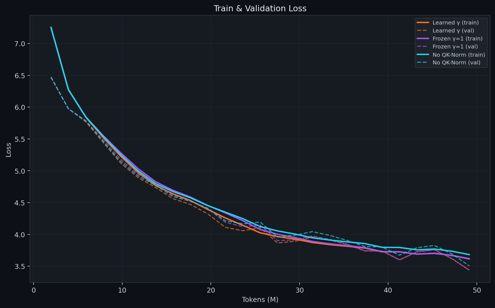

# QK-Norm Might Worsen Muon Optimizer LLM Training

> **Note:** This is an exploratory blog post documenting early-stage observations from a single-seed experiment. The findings are directional signals, not established results. We run one seed per condition and train for only 50M tokens (~0.3% of Chinchilla-optimal for a 1.5B model). All claims should be read as "we observed X" rather than "X is true in general."

---

## Key Findings at a Glance

Each attention head in a transformer uses a **128-dimensional space** to represent tokens. Ideally, the model spreads its representations across all 128 dimensions. In practice, many dimensions shrink to near-zero variance — the model "collapses" into a lower-dimensional subspace. The y-axis in the figure above measures how many of those 128 dimensions are actively carrying variance (higher = more dimensions in use). **Important:** near-zero variance doesn't mean a dimension is useless — it could still encode critical features. PR measures geometric spread, not information content.

**QK-Norm** is a technique that does two things to the attention vectors: (1) it **normalizes** them (controls their magnitude), and (2) it multiplies each dimension by a **learnable weight called γ** — essentially giving the model a volume knob for each dimension. We wanted to know: when QK-Norm helps, which part is actually responsible?

If you need explanation of the QK-Norm and γ (gamma) scroll below first.

We trained a **1.5B parameter** (full specs below) language model three times — once with full QK-Norm, once with normalization but the γ knobs locked at 1.0 (so the model can't adjust them), and once with no QK-Norm at all. Here is what we found:

1. **The γ knobs — not the normalization — appear to control how many dimensions carry variance.** The orange line (full QK-Norm) recovers to 65.7 dimensions. The purple line (normalization but γ locked) recovers to only 59.6 — *worse* than the cyan line (no QK-Norm at all, 63.3). Locking the γ knobs makes the model *worse* than not normalizing in this single-seed experiment.

2. **But normalization — not γ — is what makes the model learn better.** Both normalized models (orange and purple) achieve nearly identical loss, and both beat the no-QK-Norm model. The γ knobs don't affect learning speed at all on this small scale, undertrained model.

- It seems that the model still learns to predict next token well, even if some dimensions inside of the heads are becoming near-zero (holding less data).

3. **Every model goes through the same collapse-then-recovery pattern.** All three start with ~87 dimensions in use, crash to ~51–55, then recover. This U-shape appears in all three conditions, suggesting it may be a general feature of early transformer training (though this needs to be investigated further).

4. **We cannot link PR to model quality.** This is the most important caveat: the model with the *fewest* active dimensions (Frozen γ, PR=59.6) achieves the *best* loss (3.614). **Higher PR does not mean a better model in our experiment.** γ controls a geometric property (how evenly variance is spread) that we cannot yet connect to downstream performance. Whether collapsed dimensions represent wasted compute or efficient compression remains an open question — and the answer may well be "the model doesn't need all 128 dimensions."

Below we define every technical concept, then walk through the figures step by step.

---

### Concepts You Need First

#### What is γ (gamma)?

In a transformer attention head, each token is projected into a 128-dimensional **key** vector. **QK-Norm** applies RMSNorm to this vector, which does two things:

1. **Normalize** — divide every element by the root-mean-square of the whole vector, so the vector has a controlled magnitude.
2. **Scale by γ** — multiply each of the 128 elements by its own learnable weight $\gamma_j$.

$$\text{RMSNorm}(\mathbf{x})_j = \gamma_j \cdot \frac{x_j}{\sqrt{\frac{1}{128}\sum_{i=1}^{128} x_i^2}}$$

Think of γ as a **per-dimension volume knob**. Each of the 128 dimensions gets its own knob, initialized to 1.0 (all equal). As training progresses, the model can turn some knobs up (amplify that dimension) and others down (suppress it), giving it direct control over which dimensions matter.

**Concrete example** with a 4-dimensional vector $\mathbf{x} = [2, 4, 6, 8]$:
- RMS = $\sqrt{(4 + 16 + 36 + 64)/4} = \sqrt{30} \approx 5.48$
- After normalization: $[0.365,\ 0.730,\ 1.095,\ 1.461]$ (all values rescaled)
- Now suppose training learns $\gamma = [1.5, 1.0, 0.5, 0.1]$:
  1. Dim 1: $0.365 × 1.5 = 0.548$ ← **amplified**
  2. Dim 2: $0.730 × 1.0 = 0.730$ ← unchanged
  3. Dim 3: $1.095 × 0.5 = 0.548$ ← **dampened**
  4. Dim 4: $1.461 × 0.1 = 0.146$ ← **nearly removed**
- Final: $[0.55,\ 0.73,\ 0.55,\ 0.15]$ — γ has reshaped which dimensions carry information.

#### What is Participation Ratio (PR)?

PR measures **how many of the 128 dimensions carry significant variance** in the key vectors. It answers: "is the model spreading variance across many dimensions, or concentrating it into a few?"

- **PR = 128** → all dimensions contribute equally (maximum diversity, full rank)
- **PR = 1** → strictly means only one singular value is nonzero and all others are exactly zero. In practice, singular values are never exactly zero — they are just very small. So a real model might show PR = 2–3 in a severe collapse, meaning variance is overwhelmingly concentrated in 2–3 dimensions while the remaining ~125 carry negligible (but not zero) variance.
- **PR ≈ 60** (what we observe) → roughly 60 of 128 dimensions carry significant variance

When PR drops, variance concentrates into fewer dimensions — many key dimensions shrink to near-zero variance. This is called **dimensional collapse** (or rank collapse). **Important caveat:** a low-variance dimension is not necessarily a useless dimension. It could still encode subtle but critical distinctions (e.g., binary features). PR measures geometric spread, not information content. Whether collapsed dimensions represent wasted compute or efficient compression remains an open question.

#### The Three Experimental Conditions

We train the same 1.5B model three times, changing only how QK-Norm is configured:

| Condition | Normalization? | γ learned? | Purpose |
|:---|:---:|:---:|:---|
| **Learned γ** | ✅ Yes | ✅ Yes | Full QK-Norm — the real thing |
| **Frozen γ=1** | ✅ Yes | ❌ No (locked at 1.0) | Ablation — has normalization but *not* the learned scaling |
| **No QK-Norm** | ❌ No | ❌ No | Baseline — no normalization at all |

**Why three conditions?** Because QK-Norm does two things at once (normalize + scale by γ). With only two conditions (on/off) we can't tell which part matters. The Frozen γ=1 condition surgically removes γ learning while keeping normalization, letting us isolate the cause.

---

### Figure 1: The Central Result — Does γ or Normalization Drive Rank?

**What this figure shows:** Lower PR (y-axis) possibly indicates more wasted compute or useless dimensions, but this needs further investigation, so let's define it strictly: The y-axis is *Participation Ratio (PR)* is the number of dimensions carrying significant variance (out of 128). Higher means variance is more evenly spread; lower means it is concentrated into fewer dimensions. The x-axis is training progress in millions of tokens.

**Reading it step by step:**

1. **All three models start at PR ≈ 87** (top-left). At random initialization, each of the 128 dimensions contributes roughly equally — the model hasn't learned anything yet.

2. **All three crash to PR ≈ 51–55 by ~8M tokens** (bottom of the U-curve). This is *rank collapse* — the model destroys its initial random structure as it begins learning. This happens regardless of whether QK-Norm is used.

3. **After the collapse floor, the three lines diverge** — this is where the experiment reveals its answer:
   - 🟠 **Learned γ (orange)** recovers the fastest and highest, reaching PR = **65.7**
   - 🔵 **No QK-Norm (cyan)** recovers to PR = **63.3** — surprisingly, the second-best
   - 🟣 **Frozen γ=1 (purple)** recovers the least, only to PR = **59.6**

4. If normalization were the key mechanism for recovery, the two normalized models (Learned γ and Frozen γ) would recover similarly. Instead, removing γ learning (Frozen) makes it *worse* than having no normalization at all. **In this experiment, the learned γ parameter — not the normalization — appears to be what drives rank recovery.** (Caveat: this is a single-seed result; the 6-unit difference could narrow or widen with different seeds.)

### Figure 2: Loss Tells a Different Story

**What this figure shows:** Training and validation loss (lower = better language modeling) over the same 50M tokens.

**Reading it step by step:**

1. **Both normalized models (Learned γ and Frozen γ) achieve nearly identical loss** — around 3.62 for training, 3.44 for validation. They overlap almost perfectly.

2. **The No QK-Norm model has noticeably higher loss** — 3.68 training, 3.51 validation. Normalization clearly helps the model learn better.

3. **But here's the key insight:** Compare this to Figure 1 above. For *loss*, normalization helps equally whether γ is learned or frozen. For *rank*, only learned γ helps — frozen γ actually hurts. **This suggests loss and rank are driven by different mechanisms:**
   - **Normalization → stabilizes gradients → lowers loss** (doesn't need γ)
   - **Learned γ → selectively amplifies/suppresses dimensions → maintains dimensional diversity** (needs γ)

4. **An open question emerges:** The Frozen γ=1 model has the *lowest* PR (59.6) but achieves the *best* loss (3.614). If the collapsed dimensions contained critical information, we would expect worse loss. This suggests either (a) those dimensions are genuinely redundant at this training stage, (b) 50M tokens is too early for the rank difference to manifest in loss, or (c) PR captures geometric properties that don't directly map to task-relevant information. We cannot yet determine which explanation is correct.

### The Three Main Observations, Explained

> **Observation 1: "γ appears to drive dimensional diversity, normalization drives loss."**
>
> *What this means:* In our experiment, QK-Norm does two things, and they appear to be independent. The normalization step (dividing by RMS) helps the model train faster (lower loss). The learned γ weights help the model maintain higher effective dimensionality in the key space. **However, we cannot yet link higher PR to better model quality** — at 50M tokens, Frozen γ achieves the *lowest* PR but the *best* loss. γ controls a geometric property that may or may not matter for downstream tasks.

> **Observation 2: "PR follows a U-shaped trajectory."**
>
> *What this means:* Every model — with or without QK-Norm — goes through the same three phases: (1) rank collapses as random initialization is destroyed, (2) rank recovers as the model learns meaningful structure, (3) rank plateaus. We observe this in all three conditions, suggesting it may be a general feature of early transformer training.

> **Observation 3: "Normalization without γ appears counterproductive for rank."**
>
> *What this means:* If you apply QK-Norm but freeze γ at 1 (so every dimension is treated equally), you actually get *worse* rank than not using QK-Norm at all in our experiment. One possible explanation: the normalization projects all key vectors onto a sphere, which constrains the geometry. Without γ to selectively stretch dimensions, this constraint *limits* the model's ability to differentiate dimensions, causing more collapse than if you just left the keys unnormalized. We have not verified this mechanistic explanation — it is a hypothesis consistent with the data.

### Additional Observation: Depth-PR Gradient Inversion

> In a pilot study at 500K tokens, we observed the standard depth-PR gradient: early layers had higher rank (~122) and deep layers had lower rank (~106), with a roughly linear decline of ~0.47 PR units per layer. This is consistent with deeper layers receiving stronger gradient signal from the loss and reorganizing their spectra faster.
>
> By 50M tokens, this pattern **inverts** — deeper layers develop *higher* PR than shallow layers. The model's internal structure appears to reorganize as training progresses, with later layers developing more complex, higher-dimensional representations over time.
>
> **Caveat:** This comparison is between two separate experiments (a 500K pilot and this 50M run) with different evaluation batch sizes and slightly different configurations. We present this as an interesting observation, not a rigorous finding. A proper analysis would require tracking per-layer PR continuously within a single run, which our data supports (see Section 3.2).

---

## 1. Overview

This post investigates how **QK-Normalization** (RMSNorm applied to both query and key projections) affects dimensional collapse in transformer attention heads. In our Gemma-style architecture, RMSNorm is applied to **both Q and K** independently before rotary position encoding — hence the name "QK-Norm."

We train a **1.5B parameter** dense LLM for **~49M tokens** under the three conditions described above to disentangle the effect of normalization from the effect of the learned scale parameter ($\gamma$). This is an ablation study with a single seed per condition — our findings are preliminary observations that require replication.

### Architecture & Training Config

| Parameter | Value |
|:---|:---|
| **Model Size** | ~1.58B Parameters |
| $d_\text{model}$ | 2048 |
| Layers | 32 |
| Attention Heads | 16 ($d_k = 128$) |
| KV Heads | 8 (GQA) |
| $d_\text{ff}$ | 8192 |
| **Training Budget** | **~49M Tokens** per condition |
| **Hardware** | NVIDIA H100 80GB |
| Batch Size | 8 |
| Grad Accumulation | 4 |
| Effective Batch | $8 \times 4 \times 2048 = 65{,}536$ tokens/step |
| Optimizer | Muon + AdamW |
| Dataset | FineWeb/Cosmopedia Mix (1B subset) |

---

## 2. Results Summary

| Metric | Learned γ | Frozen γ=1 | No QK-Norm |
|:---|:---:|:---:|:---:|
| **Initial Mean PR** | 86.85 | 86.85 | 86.42 |
| **Minimum Mean PR** | 55.17 (7.9M) | 51.84 (9.8M) | 51.28 (7.9M) |
| **Final Mean PR (49M)** | **65.70** | 59.55 | 63.25 |
| **Final Train Loss** | **3.618** | **3.614** | 3.683 |
| **Final Val Loss** | **3.440** | **3.439** | 3.505 |

## 4. Mathematical Background

### 4.1 QK-Normalization

In standard attention, a token representation $\mathbf{x} \in \mathbb{R}^{d_\text{model}}$ (a 2048-dimensional vector representing one token) is projected into queries and keys:

$$Q = XW_Q, \quad K = XW_K$$

where:
- $X \in \mathbb{R}^{n \times d_\text{model}}$ is the input matrix ($n$ tokens, each a 2048-dim vector)
- $W_Q \in \mathbb{R}^{d_\text{model} \times d_k}$ is the query weight matrix (projects from 2048 → 128 dimensions per head)
- $W_K \in \mathbb{R}^{d_\text{model} \times d_k}$ is the key weight matrix (same shape)
- $d_k = 128$ is the per-head dimension

With QK-Norm (as in our Gemma-style model), RMSNorm is applied to **both Q and K independently**, before rotary position encoding (RoPE):

$$Q = \text{RoPE}\!\left(\text{RMSNorm}(XW_Q)\right), \quad K = \text{RoPE}\!\left(\text{RMSNorm}(XW_K)\right)$$

The RMSNorm operation for a single vector $\mathbf{x} \in \mathbb{R}^{d_k}$ works as follows:

$$\text{RMS}(\mathbf{x}) = \sqrt{\frac{1}{d_k}\sum_{i=1}^{d_k} x_i^2}$$

$$\text{RMSNorm}(\mathbf{x})_j = \frac{\gamma_j \cdot x_j}{\text{RMS}(\mathbf{x})}$$

where:
- $\text{RMS}(\mathbf{x})$ is a single scalar — the root-mean-square of all 128 values in the vector
- $x_j$ is the value at dimension $j$ (before normalization)
- $\gamma_j$ is a learnable scalar weight for dimension $j$, initialized to 1.0
- The output at dimension $j$ is the original value divided by the RMS, then scaled by $\gamma_j$

**Scope of γ:** Each RMSNorm layer has its **own independent** $\gamma \in \mathbb{R}^{128}$ vector. Since QK-Norm applies RMSNorm to both Q and K at every layer, there are $32 \text{ layers} \times 2 \text{ (Q and K)} = 64$ separate $\gamma$ vectors in the model, totaling $64 \times 128 = 8{,}192$ additional learnable parameters.

**What γ controls:** At initialization ($\gamma = \mathbf{1}$), the norm simply rescales the vector to have unit RMS. As training progresses, individual $\gamma_j$ values diverge — some grow above 1 (amplifying that dimension) and some shrink toward 0 (suppressing it). This gives the model a direct, per-dimension knob to control which dimensions of the key/query space are important.

**What RoPE does:** Rotary Position Encoding ($\text{RoPE}$) applies a position-dependent rotation to pairs of dimensions in the Q and K vectors. It encodes positional information without adding parameters. It is applied **after** RMSNorm, so $\gamma$ acts on the pre-RoPE representation.

### 4.2 Why This Matters for Rank

The **Participation Ratio (PR)** measures how evenly variance is distributed across the 128 dimensions of each attention head's key space. It is a geometric measure of spectral spread, not a direct measure of information content.

To compute it, we collect the key vectors $K \in \mathbb{R}^{n \times 128}$ from many tokens and compute the Singular Value Decomposition (SVD), yielding singular values $\sigma_1 \geq \sigma_2 \geq \cdots \geq \sigma_{128}$. These singular values tell us how much variance each dimension captures:

$$\text{PR}(K) = \frac{\left(\sum_{i=1}^{d_k} \sigma_i\right)^2}{\sum_{i=1}^{d_k} \sigma_i^2}$$

**Intuition:**
- If all 128 singular values are equal ($\sigma_i = c$), then $\text{PR} = 128$ — all dimensions contribute equally (full rank)
- If only one singular value is nonzero ($\sigma_1 = c$, rest = 0), then $\text{PR} = 1$ — total collapse to a single dimension
- A PR of 60 (roughly what we observe at convergence) means the information is spread across roughly 60 effective dimensions

**How each condition affects rank:**
- **Without QK-Norm**: The singular values of $K$ are determined solely by $W_K$ and the input data. The model can only control rank through the weight matrix.
- **With QK-Norm (Learned γ)**: The explicit $\gamma$ parameter can independently amplify or suppress each dimension — giving the model a direct, low-resistance path to shape the spectrum.
- **With QK-Norm (Frozen γ=1)**: Normalization constrains key norms but without per-dimension flexibility, creating a geometric constraint that limits spectral diversity.

## 5. γ Dynamics

The γ coefficient of variation (CV) reveals how the model uses the learnable parameter:

- **High γ CV layers** (L0: 0.169, L15: 0.155, L27: 0.172): Aggressive dimension differentiation, correlated with higher PR recovery.
- **Low γ CV layers** (L5–L10: 0.07–0.08): Minimal differentiation, correlated with the lowest PR values.
- **Frozen γ=1**: CV = 0.0 at all layers (confirming ablation correctness).

### 5.1 Final γ Values: What Did the Model Learn?

We saved the final γ values for all 32 layers at the end of training (49M tokens). Here is what we found:

**γ values are mostly > 1.0 — the model amplifies rather than suppresses.** The global mean γ across all layers is ~1.19. Only Layer 0 has a mean γ below 1.0 (mean = 0.913). All other layers have mean γ between 1.04 and 1.37. This is the opposite of what we initially expected — rather than using γ to zero out unwanted dimensions, the model uses it to **amplify** most dimensions, with selective per-dimension variation around that elevated baseline.

| Layer Zone | Layers | Mean γ | Interpretation |
|:---|:---:|:---:|:---|
| **Shallow** | 0–7 | 1.084 | Closest to initialization, Layer 0 is the outlier |
| **Middle** | 8–23 | 1.298 | Strongest amplification |
| **Deep** | 24–31 | 1.238 | Slightly less than middle layers |

**Layer 0 is uniquely asymmetric.** Layer 0 shows a striking pattern: the first 64 dimensions (which correspond to high-frequency RoPE rotations) have a mean γ of 1.017, while the last 64 dimensions (low-frequency RoPE rotations) are suppressed to a mean of 0.810. Layer 0 has 14 dimensions with γ < 0.7 — all of them in the last 64 dims. No other layer shows this asymmetry. This suggests the first layer learns to de-emphasize positional information carried by low-frequency RoPE components.

**γ differentiation correlates with PR recovery.** The layers with the most non-uniform γ distributions (highest CV: L27=0.172, L0=0.169, L15=0.155) tend to be the layers with the most distinct PR behavior. Layers with nearly uniform γ (lowest CV: L9=0.068, L10=0.072, L5=0.078) show minimal dimension differentiation.

**Key limitation:** We only have γ values at the *final* checkpoint. We cannot track how γ evolved during training — did suppressed dimensions start low and stay low, or did they start at 1.0 and gradually decline? Tracking individual γ trajectories would reveal whether dimension selection happens early (during collapse) or late (during recovery). This is a clear next step for future work.

## 6. Limitations

1. **Single Seed**: We run one seed per condition. The effect size (2–6 PR units) could easily shift or reverse with different random seeds. Without variance estimates, none of our PR differences are statistically confirmed.
2. **Early Training**: 50M tokens is ~0.3% of Chinchilla-optimal for a 1.5B model. We observe early-phase dynamics, not convergence behavior. The U-shaped trajectory and plateau could be transient phenomena.
3. **Key-Only Analysis**: We measure the PR of Keys ($K$). The effective rank of the full attention matrix ($QK^T$) also depends on Queries ($Q$), which we do not probe. It is possible that Q compensates for K collapse, or that the rank of $QK^T$ tells a different story.
4. **Muon Optimizer**: Muon's orthogonal updates may interact with spectral dynamics in ways specific to this optimizer. All findings may be Muon-specific artifacts.
5. **PR does not predict model quality**: This is perhaps the most important limitation. Participation Ratio captures how evenly variance is spread across dimensions — it does not measure how much task-relevant information each dimension carries. **Our own data shows that lower PR is associated with equal or better loss** (Frozen γ=1 has the lowest PR and the best loss). Until we can establish a link between PR and downstream model quality, the practical significance of γ driving higher PR remains unknown.
6. **No singular value distributions**: We compute PR from SVD but do not save the full singular value spectrum. This means we cannot determine whether γ creates a gradual taper vs. a sharp cutoff in the eigenspectrum, which would help distinguish "efficient compression" from "dead dimensions."
7. **No downstream evaluation**: We measure loss but do not evaluate on any benchmark or downstream task.

### Future Work

The following would strengthen or modify these findings:

- **Multiple seeds** (≥3) for variance estimation — the single most important next step. Our PR differences (2–6 units) may be within noise.
- **Extend training to 250M–1B+ tokens** to determine whether the PR plateau is stable, whether the PR/loss dissociation resolves, and whether γ's geometric control eventually translates to quality differences.
- **Measure query PR** alongside key PR, and compute the effective rank of $QK^T$ directly, to get a complete picture of attention head dimensionality.
- **Save full singular value distributions** at training checkpoints — this would reveal whether γ creates a smooth taper or a sharp rank cutoff, which matters for understanding the mechanism.
- **Track individual γ trajectories** over training to determine when dimension selection happens (during collapse, during recovery, or continuously).
- **Pure AdamW baseline** to determine how much of the observed dynamics are specific to Muon's orthogonal updates.
- **Downstream benchmark evaluation** to test whether PR differences at 50M tokens correspond to quality differences on actual tasks.
