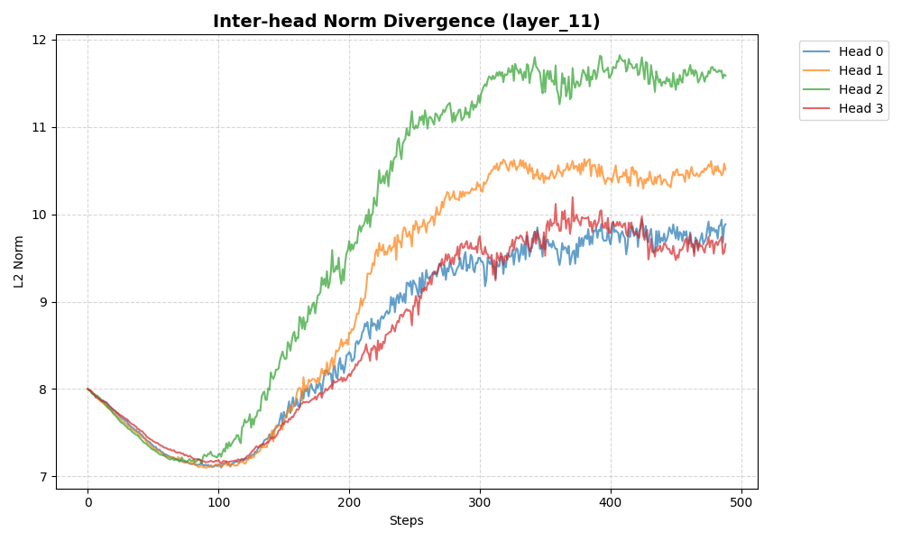
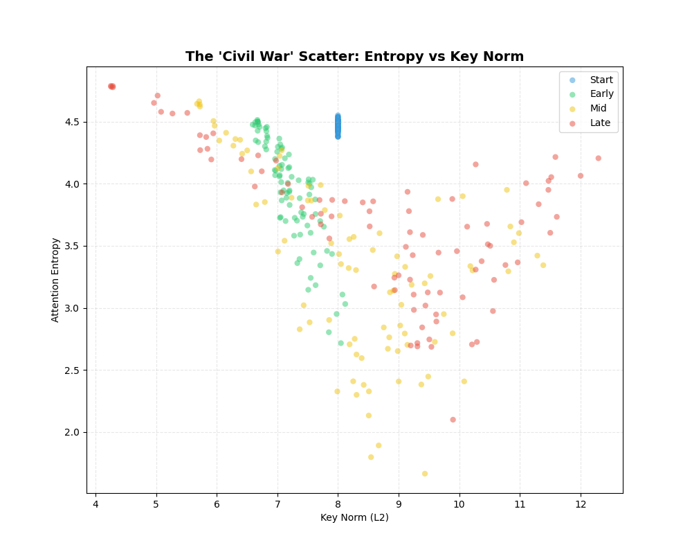

# Research Report: The Attention Civil War
## Head Specialization and Dimensional Collapse in Transformers

---

### 🔬 The Discovery: Layers are not Homogeneous
In previous experiments, we looked at **layer-level** averages. But that was hiding the truth. Our latest experiment tracked every attention head independently during training, and we discovered something radical: **Within the same layer, individual heads split into opposing functional groups.**

Some heads become "Sinks" (focused, high-energy), while others remain "Gatherers" (diffuse, low-energy). This is the **Attention Civil War**.

*Figure 1: While all heads start at norm 8.0, they rapidly bifurcate. Note how Head 2 (Green) aggressively claims magnitude, while others stay lower.*

---

### 🧠 Phase 1: Tracking the Great Divergence

#### 📚 The Concept: Inter-head Variance
Transformers usually treat all heads in a layer the same (they share the same RMSNorm parameters). We wanted to know: does the model use that shared "budget" equally?

**The Result:** No. Around step 100, the "Civil War" begins. 
*   **Initial Calm:** All heads first *decrease* their norm to ~7.1. This is the model "compressing" raw data.
*   **The Bifurcation:** After the compression, specific heads are "promoted" to high magnitude. They don't just drift; they move with purpose to different energy levels.

---

### 🧪 Phase 2: Entropy vs. Magnitude (The "Focus" Law)

#### 📚 The Concept: Shannon Entropy
If a head has **High Entropy**, it is paying attention to everything (it's "blurry"). If it has **Low Entropy**, it is paying attention to exactly one or two things (it's "sharp").

*Figure 2: The evolution of the Attention Landscape. Each dot is one head.*

**The Observations:**
1.  **Start (Blue):** All heads are identical.
2.  **Early/Mid (Green/Yellow):** The cluster stretches. A clear correlation appears: **Higher Magnitude = Sharper Focus.**
3.  **Late (Red):** The cluster shatters. You can clearly see two distinct populations:
    *   **The Sinks (Bottom Right):** Very high norm (>11), near-zero entropy. These are the "fixed switches."
    *   **The Gatherers (Top Left):** Low norm (~5), high entropy. These are the "contextual mixers."

---

### 📐 Phase 3: Dimensional Collapse (Effective Rank)

#### 📚 The Concept: Participation Ratio
Even if a head has 64 dimensions, it might only use a few. We measure the **Participation Ratio (PR)**. A PR of 64 means all dimensions are used equally. A PR of 1.0 means everything is squeezed into a single dimension.

*Figure 3: The "Pruning" of the internal latent space.*

**The Discovery:**
The model aggressively **kills off unused dimensions**.
*   All layers start using ~24 dimensions.
*   By the end of training, Middle Layers collapse to roughly **11 dimensions**.
*   **Conclusion:** The model is "burning away" the noise. It only needs about 15% of its theoretical capacity to perform the attention logic.

---

### 🚀 Phase 4: The "Volume Knob" (Gamma Heatmap)

#### 📚 The Concept: Learnable Gains
How does the model control this? It learns a **Gain Vector ($\gamma$)**. This is a list of 64 numbers that scale the dimensions.

*Figure 4: The learned "Coordinate System" of a layer.*

**Analysis:**
The horizontal lines of bright yellow are **"Golden Dimensions."** 
*   The model chooses specific dimensions (e.g., index 0, 10, 15) and amplifies them across all tokens.
*   By step 200, the "coordinate system" is fixed. The model has "voted" on which dimensions carry the most important signals.

---

### 📈 Final Taxonomy
This experiment proves that a Transformer is not just a stack of identical layers. It is a **Hierarchy of Specialists**.

1.  **Static Sinks:** These heads use the "Golden Dimensions" to point at separators (like Token 0). They have high norms and very low entropy.
2.  **Syntactic Gatherers:** These heads ignore the Golden Dimensions, stay at low norms, and preserve high entropy to understand the overall "vibe" of the text.
3.  **Semantic Retrievers:** Heads that use high magnitude only when the Query matches a specific Key—the "interactors."

---

### 💻 Methodology Notes
*   **Tracking:** We hooked into the `k_norm` output of a 22-layer model (88M parameters).
*   **Computation:** Metrics were calculated in real-time over 4 million training tokens using `bfloat16`.
*   **Code:** All research tools are available in the `research/` directory.
