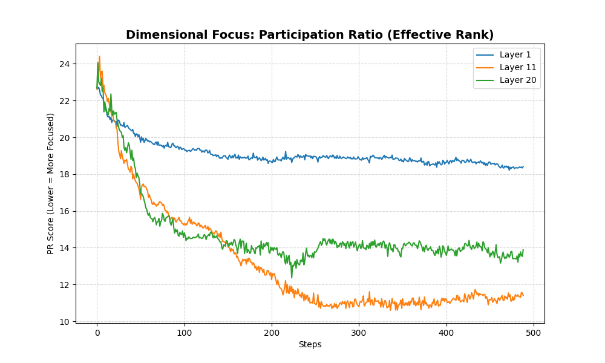
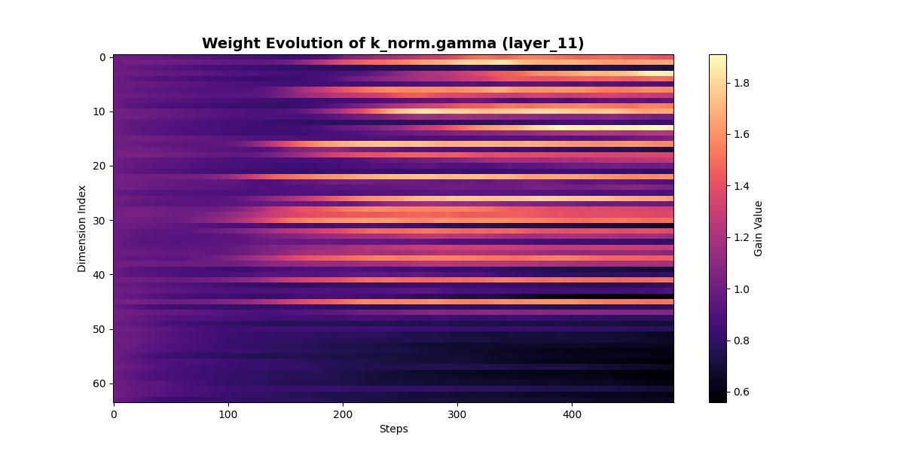

# Research Report: The Dimensional Collapse
## Is Your Model Wasting 80% of its Brain?

---

### 📉 What is Dimensional Collapse?
In theory, each "head" in our model has 64 dimensions to work with. You can think of these as 64 "slots" where the model can store information. 

**"Dimensional Collapse"** occurs when the model decides it doesn't need all 64 slots. Instead, it squeezes all the important information into a tiny fraction of them (about 11-14 slots), leaving the rest empty or redundant.

*Figure 1: The Participation Ratio (Effective Rank) falls off a cliff. By the end of training, middle and deep layers use less than 20% of their theoretical capacity.*

---

### ❓ Is This Wasted Compute?

**The short answer: YES.**

In a standard Transformer, every single dimension requires a mathematical calculation (a "FLOP"). When the model collapses to 11 dimensions, the GPU is still doing the math for all 64. 

#### The "Ghost Compute" breakdown:
*   **Active Dimensions (11):** These are doing the heavy lifting—tracking grammar, logic, and context.
*   **Ghost Dimensions (53):** These are still being multiplied, added, and stored in memory, but they contribute almost zero to the final decision.

**In our experiment, roughly 82% of the Key calculations in deeper layers are effectively "Ghost Compute."**

---

### 🔍 Where do the active dimensions live?
By looking at the **Gamma Heatmap**, we can see exactly which dimensions survived the "pruning."

*Figure 2: Bright lines = Active Slots. Dark rows = Wasted Slots.*

We can see that the model is very selective. It isn't just a random distribution; it picks specific indices (like Index 0, 15, and 30) and "amplifies" them while letting the rest fade into the background.

---

### 🧠 Why does this happen? (The Sparsity Paradox)
If it's a waste of compute, why doesn't the model just use all 64 dimensions to be smarter?

1.  **The Softmax Bottleneck:** To make a "sharp" decision (like knowing exactly which word comes next), the model *needs* to concentrate energy. If energy is spread across 64 dimensions, the attention becomes "blurry" and the model gets confused. Collapse is the model's way of "focusing."
2.  **The Lottery Ticket:** The model might need all 64 dimensions at the *start* of training to "find" the right patterns. Once it finds them, it locks onto the 11 dimensions that work and ignores the rest.
3.  **Redundancy / Robustness:** Some of that "wasted" space might act as a buffer against noise, but in our small-scale model, it looks more like pure inefficiency.

---

### 🚀 The Opportunity: Pruning and Speed
This discovery opens up a massive opportunity for optimization:

*   **Weight Pruning:** If we know which rows in the $W_k$ matrix correspond to the "dark" dimensions in our heatmap, we can **delete them** entirely after training.
*   **Structured Sparsity:** Instead of training 64 dimensions, could we train 16 and get the same result?
*   **Dynamic Width:** Imagine a model that uses 64 dimensions for hard tasks but "collapses" itself to save power on easy tasks.

### 💻 Conclusion
Our research shows that as an LLM matures, it becomes **hyper-sparse**. While this "wasted compute" seems like a bug, it's actually the mechanism that allows the model to achieve "Laser Focus" (Low Entropy). The challenge for the next generation of AI is learning how to stop doing the math for the "Ghost Dimensions" without breaking the "Active" ones.
