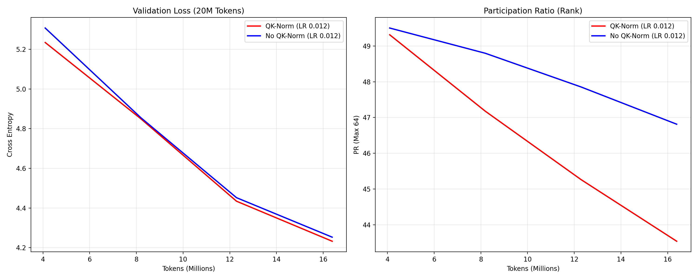
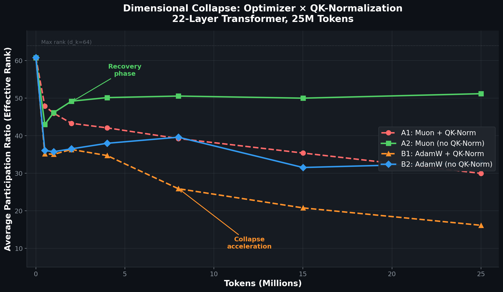
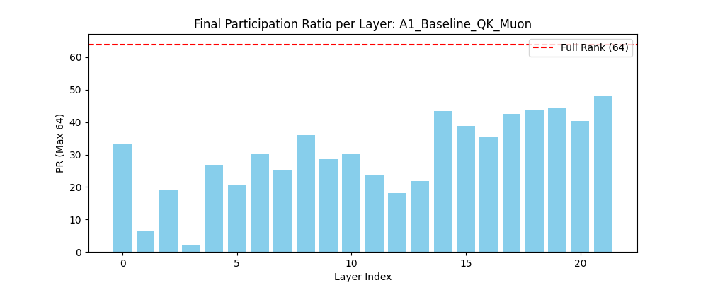
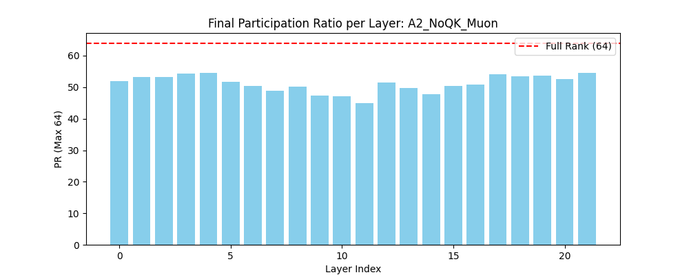
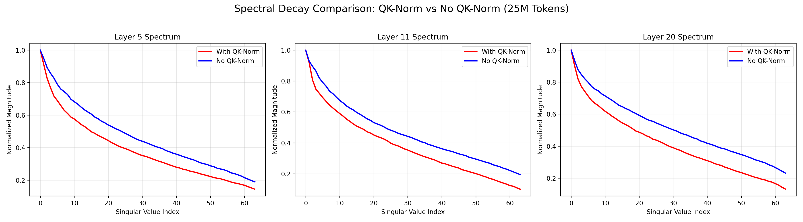

# Does QK-Norm Help or Hurt? Some Observations from Training with Muon

> **Setup:** 88M parameter transformer, 22 layers, 64-dim heads, Muon optimizer, trained on FineWeb-Edu.
> Two identical runs — one with QK-RMSNorm on queries and keys, one without.

---

## 1. The Loss Looks Fine. Maybe Even Better with QK-Norm.

At ~16M tokens, the validation loss tells a simple story:

| Config | Val Loss (16M tokens) |
| :--- | :--- |
| **Muon + QK-Norm** | **4.233** |
| **Muon (no QK-Norm)** | **4.253** |

QK-Norm gives a slightly better loss. The gap was larger early on (~0.07 at 4M tokens) and shrank to ~0.02 by 16M.

If you only looked at the loss curve, you'd conclude: *QK-Norm helps. Ship it.*

But what's happening inside the model?

---

## 2. Something Weird is Happening to the Representations

Look at the right panel of the plot above. That's the **Participation Ratio (PR)** — a measure of how many of the 64 available dimensions each attention head is actually using.

| Config | PR at 4M | PR at 16M | Trend |
| :--- | :--- | :--- | :--- |
| **Muon + QK-Norm** | 49.3 | **43.5** | 📉 Steadily falling |
| **Muon (no QK-Norm)** | 49.5 | **46.8** | 📉 Falling, but slower |

Both are dropping. But QK-Norm is collapsing **faster**. By 16M tokens, the QK-Norm model is using ~7% fewer effective dimensions than the version without it.

This gap just keeps getting wider. Here's what happens if you train longer (25M tokens, separate experiment):

At 25M tokens the QK-Norm run falls to PR ≈ **30** while the no-QK-Norm run stabilizes around PR ≈ **51**. That's a 70% difference in effective dimensionality.

Is this even a problem? The model with fewer active dimensions still has slightly better loss... *for now*. But is it building something fragile?

---

## 3. Where Does the Collapse Happen?

This is where it gets interesting. The collapse isn't uniform across layers.

**Muon + QK-Norm (25M tokens) — some layers are basically dead:**

Look at layers 1 and 3 — their PR dropped below **10**. Out of 64 possible dimensions, these layers are only using ~10. The rest is what we call "ghost compute" — the GPU is doing math on dimensions that contribute almost nothing.

**Muon without QK-Norm (25M tokens) — uniform and alive:**

Every single layer maintains PR > 45. No layer "died." The representational bandwidth is remarkably uniform across the entire network.

Why would normalization cause some layers to collapse and not others? What's special about layers 1 and 3 in the QK-Norm run?

---

## 4. The Spectral View: What the SVD Tells Us

We ran SVD on the key matrices at three different depths in the network:

**Red = QK-Norm, Blue = No QK-Norm.**

In every layer, the QK-Norm spectrum drops off sharply — a few dominant singular values carry most of the energy, and the tail dimensions are nearly silent.

Without QK-Norm, the decay is much flatter. The "tail" dimensions retain meaningful energy. Every dimension seems to be contributing something.

Is this extra spectral energy useful? Or is it noise that the model is wasting capacity on? We honestly don't know yet.

---

## 5. The Paradox

So here's what we're looking at:

| What We Measured | QK-Norm | No QK-Norm |
| :--- | :--- | :--- |
| Val Loss (16M) | ✅ **4.233** (better) | 4.253 |
| Effective Rank (16M) | 43.5 | ✅ **46.8** (higher) |
| Effective Rank (25M) | 30 (collapsing) | ✅ **51** (stable) |
| Layer Uniformity | ❌ Dying layers | ✅ All layers alive |
| Spectral Richness | Low-rank, concentrated | ✅ Distributed |

The model that looks "worse" structurally is actually predicting tokens slightly better. The model with richer internal representations is slightly behind on loss.

Some questions we don't have answers for yet:

- **Does the structural advantage eventually translate to better loss?** The gap was shrinking at 16M tokens. Given enough data, does the no-QK-Norm model catch up or overtake?
- **Is QK-Norm "cheating"?** Does it find low-rank shortcuts that minimize cross-entropy but sacrifice something downstream — like in-context learning, or reasoning, or generalization to OOD data?
- **Is Muon's orthogonalization already doing what QK-Norm does?** The no-QK-Norm run never exploded. No instability. Muon seems to provide enough implicit regularization on its own. So what's QK-Norm actually adding, besides the collapse?
- **Is a PR of 51 even better than a PR of 30?** Maybe the collapsed model is more "efficient" — it found the 30 dimensions that matter and stopped wasting compute on the rest. Or maybe it's painting itself into a corner.
- **What happens at 100M+ tokens?** All of this is small-scale. This could reverse entirely at longer training horizons.

---

## What We Think Might Be Happening (Hypothesis, Not Conclusion)

QK-RMSNorm projects query and key vectors onto a unit hypersphere before computing attention. This bounds the logit scale and stabilizes training — which is why you see faster early convergence.

But it also constrains the geometry. Muon's orthogonalization pressure wants to push weight matrices apart (keep them high-rank), while the normalization layer is squishing the outputs back onto a sphere. Over time, the sphere "wins" — and the model converges to a lower-rank solution because that's the easiest thing to do on a constrained surface.

Without the norm layer, Muon can push into higher-rank configurations freely. The model trains a bit slower at first, but its internal representations stay diverse and distributed.

Whether that diversity actually matters for downstream capabilities — that's the real question we haven't answered yet.

---

*Observations from an 88M parameter dense transformer. February 2026.*
*This is exploratory work at small scale. None of this should be taken as definitive.*
