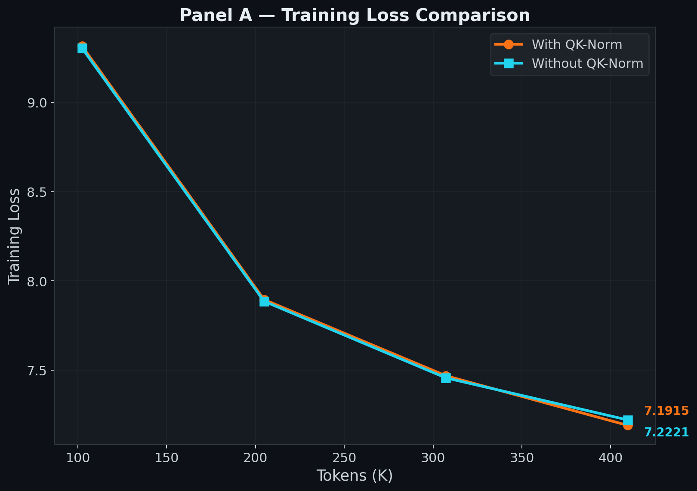
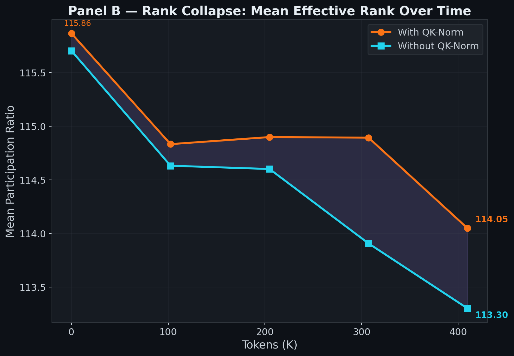
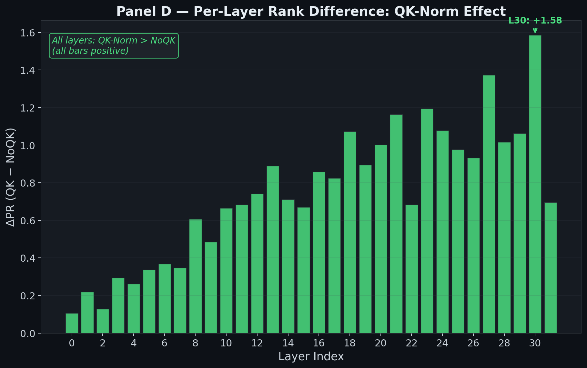

# QK-Norm and Rank Collapse at 1B Scale: A 500K Token Study

## 1. Overview

This study investigates whether **QK-Normalization** (RMSNorm applied to query and key projections) affects dimensional collapse in transformer attention heads during the earliest phase of pretraining.

We train a **1.5B parameter** dense LLM for **500,000 tokens** under two conditions — with and without QK-Norm — while measuring the **Participation Ratio (PR)** of key representations via Singular Value Decomposition at regular intervals. All other variables (seed, data, optimizer, architecture) are held constant.

**Scope and limitations:** 500K tokens is an extremely small training budget. The model is barely past initialization ($\mathcal{L} \approx 7.2$ vs. random-guessing baseline $\approx 10.8$). This is a **preliminary observation**, not a definitive conclusion. We have a single seed and only 5 measurement points. The findings reported here are directional signals that require longer training runs at the same scale to confirm.

### Architecture

| Parameter | Value |
|:---|:---|
| Total Parameters | 1,577,199,616 (QK) / 1,577,191,424 (NoQK) |
| $d_\text{model}$ | 2048 |
| Layers | 32 |
| Attention Heads ($n_h$) | 16 |
| Head Dimension ($d_k$) | $d_\text{model} / n_h = 128$ |
| KV Heads (GQA) | 8 |
| $d_\text{ff}$ | 8192 |
| Optimizer | Muon ($\eta = 0.012$) + AdamW ($\eta = 0.003$) |
| Sequence Length | 2048 |
| Effective Batch | $1 \times 2048 \times 8 = 16{,}384$ tokens/step |
| Data | Cosmopedia-v2 |

The **8,192 fewer parameters** in the NoQK variant come from removing 32 layers × 2 norms (Q, K) × 128 learnable $\gamma$ parameters = 8,192 RMSNorm weights.

---

## 2. Mathematical Background

### 2.1 QK-Normalization

In standard attention, the query and key projections are:

$$Q = XW_Q, \quad K = XW_K$$

With QK-Norm (as in Gemma, our model), RMSNorm is applied **before** rotary position encoding:

$$Q = \text{RoPE}\!\left(\text{RMSNorm}(XW_Q)\right), \quad K = \text{RoPE}\!\left(\text{RMSNorm}(XW_K)\right)$$

where RMSNorm for a vector $\mathbf{x} \in \mathbb{R}^{d_k}$ is defined as:

$$\text{RMSNorm}(\mathbf{x})_j = \frac{\gamma_j \cdot x_j}{\text{RMS}(\mathbf{x})}, \quad \text{RMS}(\mathbf{x}) = \sqrt{\frac{1}{d_k}\sum_{i=1}^{d_k} x_i^2}$$

The learnable parameter $\gamma \in \mathbb{R}^{d_k}$ is initialized to $\mathbf{1}$.

**Key structural difference:** QK-Norm introduces a per-dimension learnable scale $\gamma_j$ that can independently modulate each dimension of the key vector. Without QK-Norm, all dimensional control must happen through $W_K$, which couples all dimensions through matrix multiplication. Whether this structural difference *causes* different rank dynamics is a hypothesis we aim to test — not an established fact. We did not measure $\gamma$ in this experiment.

### 2.2 Participation Ratio (Effective Rank)

For each attention head $h$ in layer $\ell$, we collect the post-RoPE key representations over a fixed evaluation batch:

$$K^{(\ell, h)} \in \mathbb{R}^{n \times d_k}$$

where $n = B \times T$ (batch size × sequence length). We compute the **compact SVD**:

$$K^{(\ell, h)} = U \Sigma V^\top, \quad \Sigma = \text{diag}(\sigma_1, \sigma_2, \ldots, \sigma_{d_k})$$

with $\sigma_1 \geq \sigma_2 \geq \cdots \geq \sigma_{d_k} \geq 0$.

The **Participation Ratio** is:

$$\text{PR}(K) = \frac{\left(\sum_{i=1}^{d_k} \sigma_i\right)^2}{\sum_{i=1}^{d_k} \sigma_i^2}$$

**Why this formula works:** Consider the normalized distribution $p_i = \sigma_i / \sum_j \sigma_j$. Then:

$$\text{PR} = \frac{1}{\sum_i p_i^2} = \frac{1}{H_2(\mathbf{p})}$$

where $H_2(\mathbf{p}) = \sum_i p_i^2$ is the **collision entropy** (Rényi entropy of order 2). This is the inverse of the Herfindahl–Hirschman Index (HHI) from economics — a standard measure of concentration.

**Boundary cases** for $d_k = 128$:

| Spectral Shape | PR Value | Interpretation |
|:---|:---:|:---|
| $\sigma_i = c$ for all $i$ (uniform) | $\frac{(128c)^2}{128c^2} = 128$ | Full rank — all dimensions contribute equally |
| $\sigma_1 = c$, all others $= 0$ | $\frac{c^2}{c^2} = 1$ | Total collapse — one dimension dominates |
| $\sigma_i = c$ for $i \leq r$, else $0$ | $r$ | Exactly $r$ active dimensions |

For our model, the maximum possible PR is **128** (one per head dimension). The per-layer PR is averaged over all 8 KV heads.

### 2.3 What PR Does and Does Not Measure

PR measures **spectral concentration** — how evenly the singular values are distributed. It is a useful proxy for effective dimensionality, but it has important limitations:

- **PR ≠ number of "used" dimensions.** A head with PR = 114 does not have 14 "dead" dimensions. All 128 singular values may be nonzero; the spectrum is simply non-uniform.
- **PR ≠ wasted compute.** Even low-variance dimensions contribute to the dot product $QK^\top$. A small singular value is not the same as zero. The relationship between PR and computational efficiency is indirect and depends on how much the low-variance dimensions contribute to downstream predictions.
- **PR is sensitive to the evaluation data.** Different input sequences would produce different key representations and potentially different PR values. We mitigate this by using a fixed evaluation batch, but the PR values are conditioned on that particular batch.

We use PR as a **relative measure** — comparing two models on the same eval batch — rather than as an absolute indicator of dimensional utilization.

---

## 3. Results

### 3.1 Summary Table

| Metric | With QK-Norm | Without QK-Norm | Δ (QK − NoQK) |
|:---|:---:|:---:|:---:|
| **Initial Mean PR** | 115.86 | 115.70 | +0.16 |
| **Final Mean PR (500K)** | 114.05 | 113.30 | **+0.75** |
| **Total PR Drop** | −1.82 | −2.40 | +0.59 |
| **PR Drop Rate** (per 100K tokens) | −0.44 | −0.59 | +0.14 |
| **Final Train Loss** | **7.192** | 7.222 | **−0.030** |
| **Most Collapsed Layer** | L30 (106.6) | L30 (105.0) | +1.58 |
| **Highest Rank Layer** | L1 (122.8) | L0 (122.6) | +0.22 |

**Caveat on effect size:** The mean PR difference of +0.75 is 0.6% relative to the maximum PR of 128. With a single seed and no variance estimate, we cannot rule out that this difference is within the noise band of different random initializations or evaluation batches.

---

## 4. Figure-by-Figure Analysis

### 4.1 Panel A — Training Loss Comparison

**What it shows:** Cross-entropy training loss (averaged over 50-step windows) vs. tokens seen, for both conditions. The orange curve is With QK-Norm; the cyan curve is Without QK-Norm. Final values are annotated at the right edge.

**Reading the curves:**

- Both curves start near $\mathcal{L} \approx 9.3$ at 100K tokens (the first measurement after step 0). This is close to the random-guessing baseline of $\ln(V) = \ln(49{,}152) \approx 10.8$, confirming the model is essentially untrained.
- Loss drops rapidly: $9.31 \to 7.19$ for QK-Norm, $9.30 \to 7.22$ for NoQK. This is a reduction of approximately $\Delta \mathcal{L} \approx -2.1$ over 400K tokens.
- The curves are **nearly overlapping** — the gap at 400K tokens is only $|7.192 - 7.222| = 0.030$ nats, or $0.42\%$ relative difference.

**Data points:**

| Tokens | QK-Norm Loss | NoQK Loss | $\Delta\mathcal{L}$ |
|:---:|:---:|:---:|:---:|
| 102K | 9.3138 | 9.3019 | +0.012 |
| 205K | 7.8956 | 7.8863 | +0.009 |
| 307K | 7.4693 | 7.4574 | +0.012 |
| 410K | **7.1915** | **7.2221** | **−0.031** |

Note: QK-Norm starts with *higher* loss (worse) at the first 3 checkpoints, but **overtakes** NoQK at the final checkpoint. The crossover happens between 307K and 410K tokens. The difference is small enough that it may not be meaningful without additional seeds.

**Interpretation:** The normalization stabilizes gradient magnitudes in the $QK^\top$ attention computation:

$$\text{Attn}(Q, K, V) = \text{softmax}\!\left(\frac{QK^\top}{\sqrt{d_k}}\right)V$$

Without normalization, the scale of $QK^\top$ entries depends on $\|Q\|$ and $\|K\|$, which can drift during training. RMSNorm constrains $\|K_h\|$, preventing attention logit explosion. This stability may explain the small loss advantage, but the 0.030 nat difference is too small to draw conclusions from a single run.

---

### 4.2 Panel B — Rank Collapse: Mean Effective Rank Over Time

**What it shows:** The mean PR (averaged over all 32 layers) vs. tokens seen. The orange curve is With QK-Norm; the cyan curve is Without QK-Norm. The shaded purple region between the curves highlights the PR gap. Initial and final PR values are annotated.

**Reading the curves:**

- **Initialization** (step 0): QK-Norm starts at PR = 115.86, NoQK at 115.70. Both are near but not at the theoretical maximum of 128. The gap from 128 at initialization ($\sim$12 units) reflects the random weight initialization — even random matrices are not perfectly uniform in their singular value spectrum. For a random Gaussian matrix $K \in \mathbb{R}^{n \times d}$ with $n \gg d$, the Marchenko-Pastur distribution predicts a non-uniform spectrum, yielding PR < $d$.

  For aspect ratio $\gamma = n/d = 8192/128 = 64$, the expected PR of a random Gaussian matrix is approximately $0.90 \cdot d \approx 115$, which matches our observed initialization values.

- **First 100K tokens**: Both curves drop sharply — QK drops to 114.83, NoQK to 114.63. This is the **fastest collapse phase**, occurring as the model moves from random weights to structured representations.

- **100K–300K tokens**: Both curves **plateau** — QK hovers at 114.89, NoQK at 114.60. The initial representation shock has been absorbed.

- **300K–400K tokens**: A **second drop** begins — both curves fall again. QK falls to 114.05, NoQK falls more steeply to 113.30.

**The PR gap over time:**

| Checkpoint | QK Mean PR | NoQK Mean PR | $\Delta\text{PR}$ (QK − NoQK) |
|:---:|:---:|:---:|:---:|
| 0 (init) | 115.86 | 115.70 | +0.16 |
| 102K | 114.83 | 114.63 | +0.20 |
| 205K | 114.90 | 114.60 | +0.30 |
| 307K | 114.89 | 113.91 | **+0.99** |
| 410K | 114.05 | 113.30 | +0.75 |

The gap generally widens, but oscillates (peak at 307K, slight narrowing at 410K). At this early stage, QK-Norm shows higher PR.

**What we can and cannot conclude:** The direction of the effect (QK-Norm having higher PR) is consistent across all 5 checkpoints, which is suggestive. However, the magnitude (+0.75 mean, which is 0.6% of $d_k$) is small. Without multiple seeds we cannot determine whether this direction would hold up under different random initializations. The observation that NoQK collapses faster at this stage is an interesting signal that warrants investigation at longer training horizons **on this same model**.

The rate of collapse can be estimated as:

$$\frac{d(\text{PR})}{d(\text{tokens})} \bigg|_\text{QK} \approx \frac{-1.82}{409{,}600} \approx -4.4 \times 10^{-6} \text{ PR/token}$$

$$\frac{d(\text{PR})}{d(\text{tokens})} \bigg|_\text{NoQK} \approx \frac{-2.40}{409{,}600} \approx -5.9 \times 10^{-6} \text{ PR/token}$$

---

### 4.3 Panel C — Per-Layer Effective Rank at 500K Tokens

**What it shows:** Side-by-side bar chart of the PR at each of the 32 layers at the 500K-token checkpoint, for both conditions. The orange bars are With QK-Norm; the cyan bars are Without QK-Norm. A horizontal dotted line at $d_k = 128$ marks the theoretical maximum.

**Reading the bars:**

- **The depth gradient is the dominant signal.** PR decreases from ~122–123 at Layer 0 down to ~105–108 at Layers 29–31. This is a span of ~17 PR units across the network depth — far larger than the QK-Norm vs NoQK difference at any single layer.
- **Layer 0** (shallowest): PR ≈ 122.7 for both. These early layers maintain nearly full spectral uniformity.
- **Layers 1–8**: PR ≈ 118–122. Some of these layers show *increasing* PR during training (PR is higher at 400K than at init), as training irons out spurious low-rank structure from random initialization.
- **Layers 15–20**: The "transition zone" — PR ≈ 111–115.
- **Layers 29–31** (deepest): PR ≈ 105–108. Deep layers develop the most non-uniform spectra, consistent with these layers being closest to the loss function and receiving the strongest gradient signal.
- **Both bars at each layer are nearly identical in height**. The QK-Norm effect is not visible at this plotting scale.

**Three-zone decomposition:**

| Depth Zone | Layers | QK Avg PR | NoQK Avg PR | QK Avg Drop | NoQK Avg Drop |
|:---|:---:|:---:|:---:|:---:|:---:|
| Shallow | 0–7 | 120.87 | 120.55 | −1.04 | −1.24 |
| Middle | 8–23 | 113.63 | 112.87 | +0.03 | −0.39 |
| Deep | 24–31 | 108.67 | 107.65 | +4.66 | +5.27 |

Note: Positive "drop" values mean PR *decreased* from initialization; negative values mean PR *increased* from init (rank recovery).

**The depth-rank relationship is approximately linear.** A rough fit to the QK-Norm data gives:

$$\text{PR}(\ell) \approx 122.5 - 0.47\ell$$

where $\ell$ is the layer index (0–31). The actual observed range (122.8 to 106.6 = 16.2 units) is close to the predicted 15 units. Residuals show a slight quadratic curvature — deeper layers collapse slightly faster than the linear trend predicts.

---

### 4.4 Panel D — Per-Layer Rank Difference: QK-Norm Effect

**What it shows:** For each layer, the difference $\text{PR}_\text{QK}(\ell) - \text{PR}_\text{NoQK}(\ell)$ at the final checkpoint. Green bars mean QK-Norm has **higher** PR. Red bars would mean QK-Norm has **lower** PR. The peak delta is annotated at Layer 30. An inset label confirms all 32 bars are positive.

**Reading the bars:**

- **All 32 bars are positive.** QK-Norm shows higher PR than NoQK at every layer. While the individual per-layer deltas are small, the *consistency* of the direction across all layers is notable.
- **The effect is depth-dependent.** The delta increases monotonically with depth:
  - **Layers 0–7** (shallow): $\Delta\text{PR} \approx +0.1$ to $+0.4$.
  - **Layers 8–15** (mid): $\Delta\text{PR} \approx +0.5$ to $+0.9$.
  - **Layers 16–31** (deep): $\Delta\text{PR} \approx +0.7$ to $+1.6$, peaking at **Layer 30** ($\Delta = +1.58$).

Exact values at key layers:

| Layer | QK PR | NoQK PR | $\Delta$ |
|:---:|:---:|:---:|:---:|
| 0 | 122.75 | 122.65 | +0.10 |
| 9 | 116.36 | 115.88 | +0.48 |
| 15 | 112.81 | 112.14 | +0.67 |
| 20 | 110.74 | 109.74 | +1.00 |
| 25 | 109.27 | 108.30 | +0.98 |
| 27 | 108.64 | 107.26 | +1.37 |
| 30 | 106.56 | 104.98 | **+1.58** |

**Layer 30 shows the maximum differential** — QK-Norm preserves 1.58 more PR units than NoQK. The depth-dependent pattern (stronger effect in deeper layers) makes physical sense: deeper layers receive stronger gradient signal from the loss, and normalization would have a larger stabilizing effect where gradients are more aggressive. However, a single-seed experiment cannot rule out that this pattern is seed-specific.

---

### 4.5 Figure 2 — Layer-wise PR Heatmap Over Time

**What it shows:** Two side-by-side heatmaps where each cell $(\ell, t)$ represents the PR of layer $\ell$ at checkpoint $t$. The color scale maps PR to the `inferno` colormap — bright yellow = high PR (≈123), dark purple/black = low PR (≈105).

**Left panel (With QK-Norm):**

- **Bottom rows (layers 0–3)**: Consistently bright yellow across all 5 checkpoints. These layers maintain PR > 120 throughout. The color barely changes from left to right — **rank-stable** during early training.
- **Middle rows (layers 10–20)**: Show a clear **left-to-right darkening** — PR decreases over training steps.
- **Top rows (layers 28–31)**: Darkest in the top-right corner — deepest layers at the latest checkpoint.
- **Layer 31 (top row)** collapses fastest: it drops from bright to dark by checkpoint 1 (100K tokens).

**Right panel (Without QK-Norm):**

- The overall pattern is very similar. The dark regions in the top-right are slightly darker/more extensive compared to the QK-Norm panel, consistent with the per-layer delta analysis.

**Observation:** The heatmap shows two independent gradients — a vertical gradient (depth determines baseline PR) and a horizontal gradient (training time drives collapse). These appear roughly independent at this early stage, but we have too few time points (5) to fit any model to the temporal structure rigorously.

---

## 5. Hypotheses for Future Testing

The following are **hypotheses** generated from this preliminary data. They are not conclusions.

### 5.1 Hypothesis: QK-Norm's Effect on Rank Changes Over Training

At 500K tokens, QK-Norm shows *higher* PR than NoQK. This raises the question: does this relationship hold at longer training horizons, or does it reverse?

**Possible mechanisms (speculative, untested):**

- **Early stabilization:** During early training, gradients are large and noisy. RMSNorm on keys constrains $\|K_h\|$, which may prevent the extreme spectral updates that drive early collapse. This would explain QK-Norm having higher PR initially.
- **Late-stage γ exploitation:** If training progresses long enough, the model could potentially learn $\gamma_j \to 0$ for unneeded dimensions, providing a lower-resistance path to rank reduction than modifying $W_K$. This is structurally possible because $\gamma$ is a per-element scale, but **we did not measure $\gamma$ in this experiment** and cannot confirm this mechanism.

**To test this hypothesis:** Run this same 1.5B model for 5–25M tokens and observe whether the PR gap (QK − NoQK) remains positive or reverses sign. Also track $\gamma$ weights at each probe step to see if any components approach zero.

### 5.2 Hypothesis: Depth-Dependent Collapse Is Gradient-Driven

The strongest structural finding is the 17-unit PR gradient from Layer 0 (~123) to Layer 31 (~106). One explanation is that deeper layers receive stronger loss gradients:

$$\frac{\partial \mathcal{L}}{\partial K^{(\ell)}} \propto \prod_{i=\ell+1}^{L} J_i$$

where $J_i$ is the Jacobian of layer $i$. Stronger gradients could drive faster spectral reorganization (and thus faster PR decline) in deeper layers.

**Alternative explanations that cannot be ruled out:**
- Deep layers may develop more specialized, lower-rank representations because of their functional role (closer to next-token prediction), not because of gradient magnitude.
- The interaction between RoPE and depth could introduce systematic spectral effects.
- Random initialization itself may produce depth-dependent spectral structure.

---

## 6. Methodology Details

### 6.1 SVD Probe Protocol

At each measurement checkpoint, we:

1. Switch the model to `eval()` mode (disabling dropout)
2. Run a **fixed evaluation batch** ($B = 4$, $T = 2048$) through the model, producing $4 \times 2048 = 8{,}192$ token representations per head
3. Hook the output of the `Rotary` (RoPE) module in each layer's attention block — this captures the post-norm, post-RoPE key representations
4. For each KV head $h$ in each layer $\ell$, reshape the captured tensor to $K^{(\ell,h)} \in \mathbb{R}^{8192 \times 128}$
5. Compute `torch.linalg.svdvals(K.float())` — using float32 for numerical stability
6. Compute PR, then average across heads within each layer
7. Remove all hooks and return to `train()` mode

**Critical note:** The evaluation batch is generated with a separate random seed (42 + 999 = 1041) and is **identical across both runs**. This ensures that PR differences are due to model weights, not evaluation data.

### 6.2 Measurement Schedule

- **Probe frequency**: Every 50 training steps
- **Steps per 100K tokens**: $100{,}000 / 2{,}048 \approx 49$ steps (at batch size 1)
- **Actual checkpoints**: Steps 0, 50, 100, 150, 200 → tokens 0, ~102K, ~205K, ~307K, ~410K
- **Total probes per run**: 5 (including initialization)

### 6.3 What We Measure vs. What We Don't

**We measure:** Post-RoPE key representations — this captures the combined effect of the input distribution $X$, the key weight matrix $W_K$, the normalization layer, and the rotary position encoding. This is what the attention mechanism actually "sees."

**We do NOT measure:**
- **Query representations** — attention is computed as $QK^\top$, and the effective rank of the attention matrix depends on both Q and K. It is possible that queries have a different PR profile, and the attention matrix itself has yet another profile. Measuring only keys gives an incomplete picture.
- **The $\gamma$ parameters** — we cannot distinguish whether PR differences come from $\gamma$, $W_K$, or the input distribution. This is a critical gap if we want to establish causation.
- **Downstream impact** — we do not know whether the observed PR differences actually affect model quality at convergence.

---

## 7. Limitations

1. **500K tokens is extremely early.** At $\text{loss} \approx 7.2$ (random-guessing baseline $\approx 10.8$), the model is barely past initialization. PR trajectories may look qualitatively different at 5M+ tokens.

2. **Single seed.** The effect size (+0.75 PR, or 0.6% of $d_k$) is small. Without variance estimates from multiple seeds, we cannot determine statistical significance.

3. **Only 5 measurement points.** We have limited temporal resolution for detecting non-monotonic behavior or phase transitions.

4. **Only keys measured, not queries.** The effective rank of the full attention computation $QK^\top$ may differ from the rank of $K$ alone.

5. **No $\gamma$ tracking.** The report's hypothesized mechanism (QK-Norm enabling rank collapse via $\gamma_j \to 0$) is structurally plausible but entirely unmeasured. Future runs must track $\gamma$ to test this.

6. **Training loss, not validation loss.** We measure running training loss (averaged over 50-step windows). This is noisier than held-out evaluation.

7. **Muon optimizer interaction.** Muon applies orthogonal updates to 2D weight matrices, which could interact with spectral dynamics in ways that AdamW would not. The results may be optimizer-specific.

---

## 8. Conclusions

### What we observed (strong signal)

1. **Rank collapse begins immediately** — within the first 100K tokens (50 optimization steps), mean PR drops by ~1 unit from initialization. This is observable regardless of noise and confirms that spectral restructuring happens from the earliest training steps.

2. **Collapse is strongly depth-dependent** — PR follows a roughly linear gradient from ~122 (Layer 0) to ~106 (Layer 30), a 16-unit drop across 32 layers. This is a robust structural finding with an effect size far above any plausible noise floor.

### What we observed (weak signal, needs confirmation)

3. **QK-Norm shows higher PR at 500K tokens** — the mean difference is +0.75, with all 32 layers showing QK-Norm ≥ NoQK. The consistency of direction across layers is suggestive, but the magnitude is small (0.6%) and we have no variance estimate.

4. **The QK-Norm effect scales with depth** — the delta ranges from +0.10 (Layer 0) to +1.58 (Layer 30). Whether this reflects a real mechanism (gradient-based stabilization) or seed-specific structure is unknown.

### What we do NOT know

- Whether this pattern holds beyond 500K tokens
- Whether QK-Norm's effect on PR reverses at longer training horizons
- What the $\gamma$ parameters are doing during training
- Whether PR differences in keys translate to PR differences in attention matrices or model quality

### Next Steps

- **Extend to 5–25M tokens** on this same 1.5B model to observe longer-term PR trajectories
- **Track $\gamma$ weights** at each probe step to test the mechanistic hypothesis
- **Measure query PR** alongside key PR for a complete picture
- **Add a pure AdamW baseline** to isolate the Muon optimizer's role in spectral dynamics
