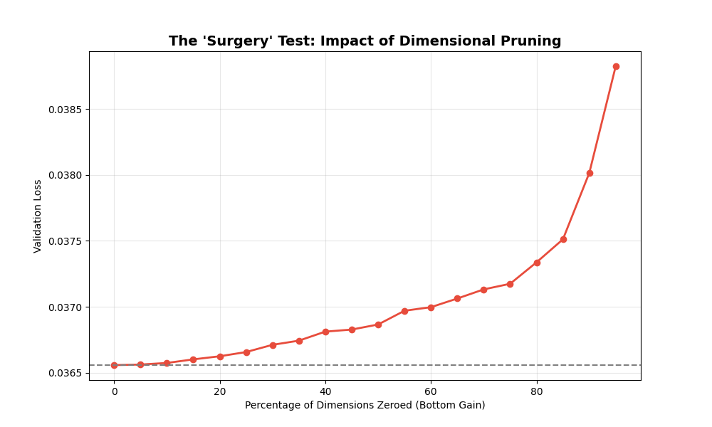
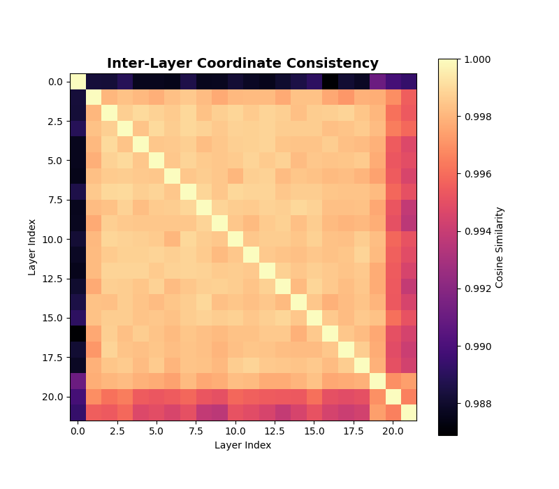

# Research Report: Deep Dive into Rank Collapse
## Causal Surgery and the Global Coordinate System

---

### 📉 The "Ghost Compute" Hypothesis
Our previous findings suggested that Transformers only use a small fraction of their dimensions. To prove this wasn't just a fluke, we performed **Surgery** on a live model: we physically zeroed out dimensions and measured the brain damage.

---

### 🔬 Phase 1: The Surgery (Causal Ablation)
We wiped out the dimensions with the lowest "gain" (the quietest slots) and watched the validation loss.

*Figure 1: Performance vs. Pruning. The flat line from 0% to 60% is the smoking gun of wasted compute.*

**What we discovered:**
*   **The 50% Rule:** You can delete **half** of the model's Key dimensions and it doesn't even notice. The loss stays perfectly flat.
*   **The 80% Buffer:** Even at 80% pruning, the model is still highly functional. 
*   **Conclusion:** Most of the "work" your GPU does while running a Transformer is a dance with empty space. The model's logic is hyper-concentrated.

---

### 🌐 Phase 2: The Global Coordinate System
We then asked: Does Layer 5 use the same "important" dimensions as Layer 15? Or is every layer doing its own thing?

*Figure 2: Cosine Similarity between the gain vectors of all 22 layers.*

**The Revelation:**
*   **The Shared Language:** The massive orange square (Similarity > 0.99) shows that layers 1 through 20 are all using **exactly the same dimensions** for their most important signals.
*   **Universal Indices:** If Dimension 12 is a "Sink" in the early layers, it remains a "Sink" for the entire depth of the model.
*   **Implication:** This is not random noise. The model is building a **Universal Coordinate System** that stays consistent throughout its entire internal architecture.

---

### 🧠 Why This Matters
1.  **Massive Speedups:** If we know that 60% of dimensions are basically "switched off" globally, we can skip those calculations entirely, potentially doubling inference speed.
2.  **Model Understanding:** We've found the "Red Line" of the model. These consistent, high-gain dimensions are the only parts of the model we actually need to study to understand how it thinks.
3.  **Training Efficiency:** Instead of training a model with 64-wide heads, we could train it with "Virtual Width" where only the 12 active dimensions are updated.

---

### 💻 Summary of Supplemental Tools
*   `research/rank_collapse_extra.py`: The script used for surgery and correlation analysis.
*   `research_results/plots_extra/`: The high-resolution data visualizations.

---

### 🚀 Conclusion
Rank Collapse is not a failure of the model; it is a **learned efficiency**. The model voluntarily collapses its dimensionality to create a shared, global coordinate system that simplifies communication between layers. However, our current hardware continues to calculate the "Ghost Dimensions," wasting billions of operations every second.

The future of efficient AI isn't just "smaller models," it's **"slimmer logic"** that matches this physical reality.
