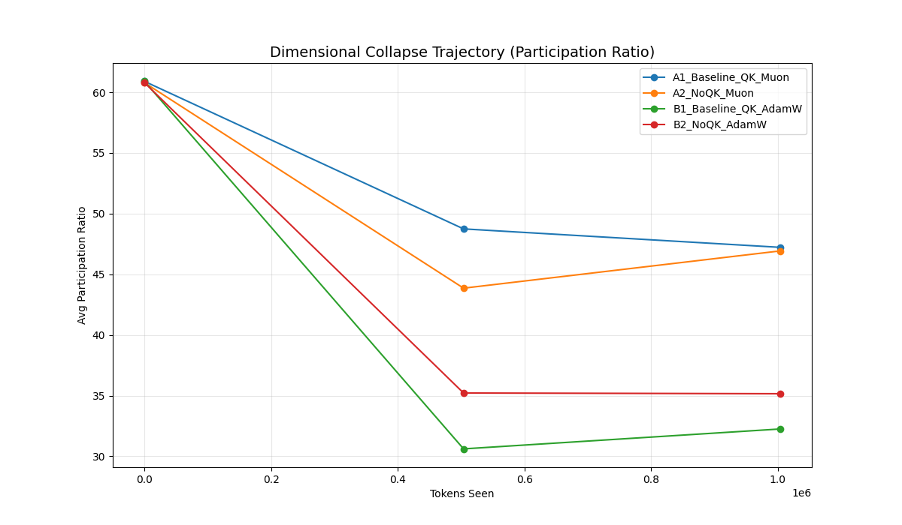
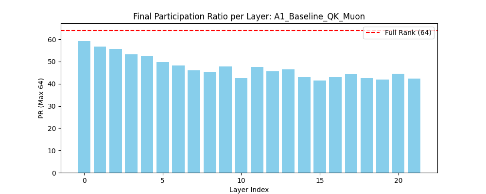

# Analysis of Dimensional Collapse (1M Token Pilot Run)

This report analyzes the pilot study comparing the **Muon** and **AdamW** optimizers and their interaction with **QK-Normalization** in maintaining representation rank during the early stages of training (1M tokens).

## 🚀 Experimental Setup
- **Model:** 22-layer MinimalLLM (64 heads, 2048 sequence length).
- **Metric:** Participation Ratio (PR), a measure of effective rank derived from the singular value distribution of attention keys.
- **Target:** 1,000,000 tokens.
- **Data:** FineWeb-Edu + Cosmopedia Mix.

## 📊 Key Findings

### 1. Optimizer Superiority (Muon vs. AdamW)
The most striking result is the significant advantage of the **Muon optimizer** in preserving effective rank.

*Figure 1: Average Participation Ratio (PR) across all layers for the first 1M tokens.*

- **Muon (A1, A2)** maintained an average Participation Ratio of **44–47**.
- **AdamW (B1, B2)** collapsed much faster, dropping to **32–35**.

### 2. The QK-Normalization Divergence
The interaction between QK-Normalization and the optimizer produced unexpected results:

*Figure 2: Layer-wise Participation Ratio for A1_Baseline_QK_Muon at 1M tokens.*

| Experiment | Optimizer | QK-Norm | 1M Avg PR |
| :--- | :--- | :--- | :--- |
| **A1 (Baseline)** | Muon | **Yes** | **~47** (Highest) |
| **A2** | Muon | No | ~44 |
| **B2** | AdamW | No | ~35 |
| **B1** | AdamW | **Yes** | **~32** (Lowest) |

- **In Muon:** QK-Normalization acts as a **stabilizer**, helping preserve rank.
- **In AdamW:** QK-Normalization appears to **accelerate** collapse in this short window. This suggests that AdamW's adaptive scaling might aggressively exploit normalized features to find one-hot representations faster.

### 3. Layer-Wise Collapse
Final PR distribution across layers (A1 Baseline):
- **Early Layers (0–5):** Maintain high rank (~50–60), indicating broad feature extraction.
- **Middle/Deep Layers:** Show significant decay, with some layers dropping below 40. This confirms that the "Middle Layer Bottleneck" is where the most aggressive axis-alignment occurs.

## 🔬 Implications for 25M Run
The 1M pilot confirms that **Muon + QK-Norm** is the most robust configuration against dimensional collapse. The 25M run will investigate if this advantage holds at scale and how it correlates with final loss and downstream knowledge acquisition.

---
*Results generated by `RankProbe` on 2026-02-18.*
