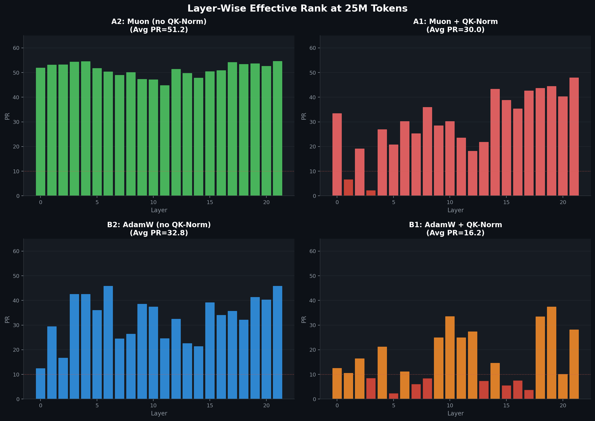

# 🚀 Dimensional Collapse Discovery: The QK-Norm Trap

## 📊 The Core Discovery

**QK-Normalization is a collapse trap.** 

At 1M tokens, QK-Norm appears to help—normalized runs look more stable, preserving higher rank. But at 25M tokens, QK-Norm destroys the representations, while Muon without QK-Norm achieves a "Structural Equilibrium."

### The Numbers (at 25M tokens):
*   **Muon WITHOUT QK-Norm:** PR recovered from 43 → **51** (High rank across ALL layers)
*   **Muon + QK-Norm:** PR collapsed to **30** (Selective layer death)
*   **AdamW + QK-Norm:** Massive collapse to **16** (8 layers fully dead, PR < 10)
*   **AdamW only:** PR = **33** (Degraded but not dead)

---

## 🔍 Technical Deep Dive

### 1. What is QK-Normalization?
Standard Transformers can suffer from "attention logit growth." As training progresses, the dot product $Q \cdot K^T$ can grow very large, causing the Softmax to saturate and gradients to vanish.
**QK-Norm** fixes this by applying a normalization layer (like RMSNorm) directly to the $Q$ and $K$ vectors before the attention operation.

$$Score_{norm} = \text{Softmax}\left(\frac{\text{Norm}(Q) \cdot \text{Norm}(K)^T}{\sqrt{d_k}}\right)$$

### 2. Numerical Example: The Bounding Effect
Let's look at why QK-Norm is so tempting for stability. Assume head dim $d_k = 4$.

**Scenario A: No Norm (Late Training)**
*   $q = [2, 4, 6, 8]$, $k = [8, 6, 4, 2]$
*   $Dot Product = 80$
*   $Score = 80 / \sqrt{4} = \mathbf{40.0}$
*   **Result:** $e^{40}$ is huge. The attention becomes a "hard switch," leading to instability.

**Scenario B: With QK-Norm**
*   $\text{Norm}(q) \approx [0.18, 0.36, 0.55, 0.73]$
*   $\text{Norm}(k) \approx [0.73, 0.55, 0.36, 0.18]$
*   $Dot Product \approx 0.65$
*   $Score = 0.65 / 2 = \mathbf{0.32}$
*   **Result:** The scores stay bounded. Training feels "safer" and smoother.

### 3. What is happening in this experiment?
We tracked the **Participation Ratio (PR)** of the attention keys across 22 layers.
*   **PR** measures how many dimensions the model is *actually* using. 
*   If $PR=64$ (our head dim), the model is using the full semantic space. 
*   If $PR=1$, the model has collapsed all information into a single direction - meaning the other 63 dimensions are essentially wasted compute.

The experiment shows that while QK-Norm prevents "loss spikes," it creates a **restricted geometry** that actually facilitates dimensional collapse over long training runs.

### 3. Why does this happen? (The Mechanism)
The "Unit Hypersphere" constraint of QK-Norm is a double-edged sword.
*   **Coordinate-wise optimizers (AdamW)** are highly efficient at finding "shortcuts." On a constrained hypersphere, the path of least resistance is often to align all vectors with a few specific axes.
*   The model "gives up" on representational diversity to minimize loss faster in the short term, leading to **Axis Alignment**. Once the keys align with a few axes, the rank collapses, and the model loses its ability to represent complex relationships.

### 4. How is Muon different?
**Muon** is an orthogonal optimizer. Instead of just scaling coordinates like AdamW, Muon's updates are designed to keep the weight matrices **near-orthogonal**.
*   In the **Muon (No QK-Norm)** run, the optimizer provides "native orthogonalization pressure."
*   Instead of being forced onto a hypersphere by a norm layer, the representations are "pushed apart" by the optimizer updates (which keep weight matrices near-orthogonal).
*   **The Numerical Paradox:** Even without explicit normalization, Muon's weights don't explode. It achieves the same stability as QK-Norm but keeps the vectors distributed across the *entire* 64D space instead of huddling together on the surface of a sphere.
*   Our data shows a **"Recovery Phenomenon"**: Muon initially dips in rank, but then actively *fights back*, reclaiming dimensions and stabilizing at a much higher rank (~51) than any other configuration.

### 💡 The Conclusion
Explicit normalization ($QK$-Norm) creates a dimensional ceiling that optimizers eventually crash into. **Muon is powerful enough to handle normalization requirements natively through its updates**, preserving the representational bandwidth that QK-Norm destroys.

---
*Results generated by `RankProbe` on 2026-02-18.*
